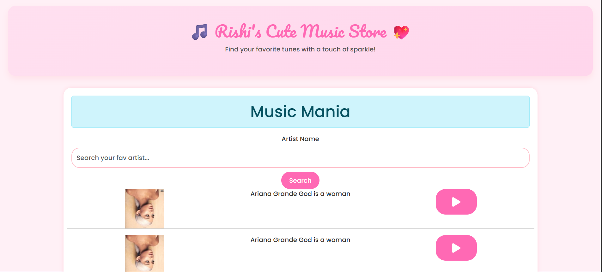
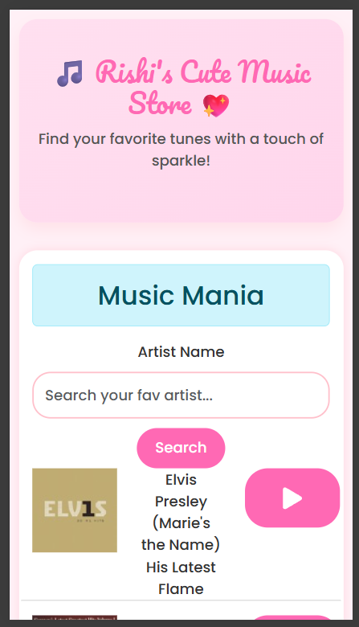
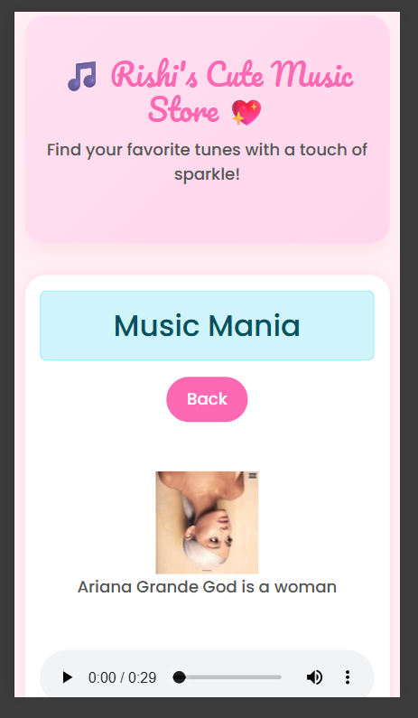
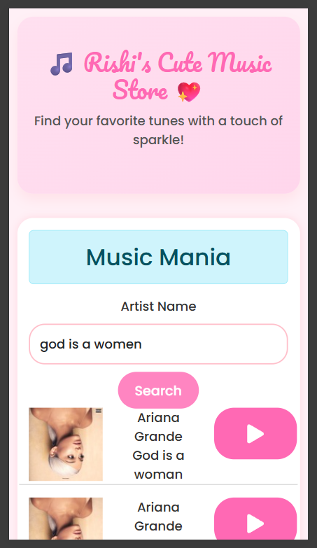

# Music-Mania
🎵 Music Mania – A cute, responsive, and user-friendly music store web app where you can explore, search, and play your favorite songs! Built with love using React and custom CSS for a girly, vibrant aesthetic. 💖  📱 Fully responsive for mobile &amp; desktop 🎨 Pastel-pink themed UI with a soft, playful layout  🎧 Built for fun, styled with flair!
# 🎵 Music Mania

**Music Mania** is a responsive and aesthetically pleasing music player web app built with **React.js**. It features a cute and girly-themed UI and lets users explore and play music with a smooth, interactive experience.






---

## ✨ Features

- 🎧 Interactive music player interface  
- 💖 Girly-themed design with soft pastels and elegant styles  
- 🔍 Search functionality (if implemented)  
- 📱 Fully responsive for desktop and mobile views  
- 🌸 Cute animations and hover effects  
- ⚛️ Built using React.js component architecture  

---

## 🛠 Tech Stack

- **Frontend Framework:** React.js (via Create React App)  
- **Styling:** CSS (custom + media queries), Bootstrap  
- **Routing & State:** React state and props (if applicable)  
- **Assets:** Custom icons, fonts, and media assets

---

## 📸 Screenshots

You can find screenshots inside the `assets/screenshots/` folder for both mobile and desktop views.

---

## 🚀 Deployment

This project is deployed live at:  
🔗 **[Live Demo](https://your-deployment-link.com)**  
_(Replace with your actual deployed link after deployment)_

---

## 🧾 Installation & Setup

To run this project locally:

```bash
git clone https://github.com/Rishita-Paliwal/Music-Mania.git
cd Music-Mania
npm install
npm start
